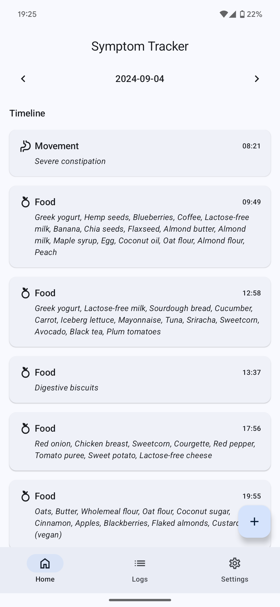
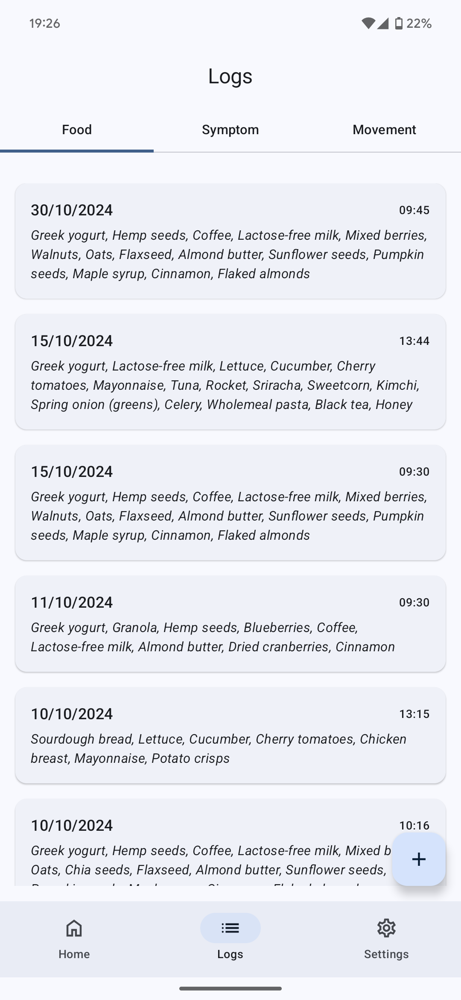
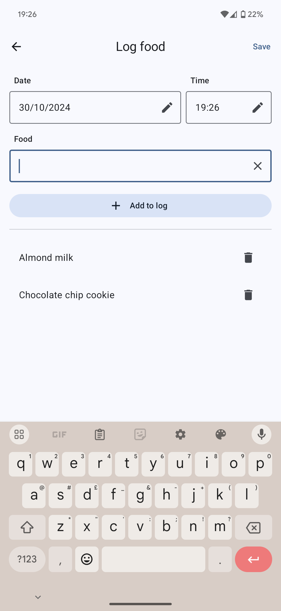
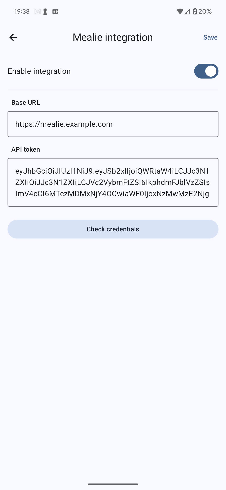
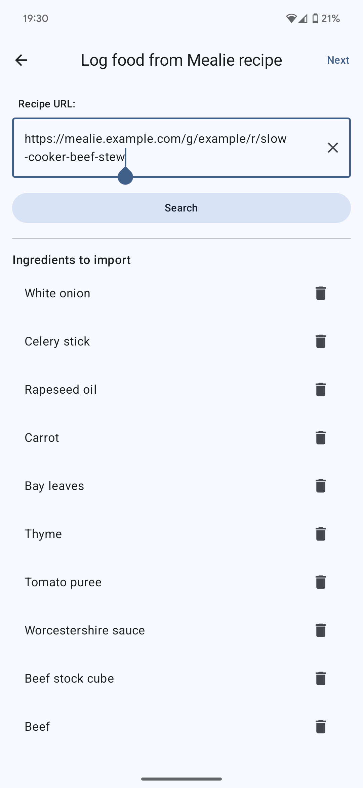

# Symptom Tracker


A simple food and symptom tracker to help identify patterns between what you eat and how you feel.
Logs your meals, snacks, symptoms and movements, and provides a simple interface to review the data.

This app was built by me for my own use, but I'm sharing it in case it's useful to others. It's a
work in progress, so there are definitely bugs and missing features 🐛.

Build
using [Jetpack Compose](https://developer.android.com/jetpack/compose), [Room](https://developer.android.com/jetpack/androidx/releases/room),
and [Hilt](https://developer.android.com/training/dependency-injection/hilt-android#hilt-and-dagger).

## Screenshots

|  |  |  |
|-------------------------------|------------------------------------|---------------------------------------|

## Mealie integration

This app can import recipes from [Mealie](https://github.com/mealie-recipes/mealie/) to pre-fill
food logs.

|  |  |
|----------------------------------------------------|------------------------------------------|

## Build instructions

Open the project in Android Studio and run the app. Or, build from the command line:

```bash
$ gradle assembleRelease
$ adb install app/build/outputs/apk/release/app-release.apk
```
